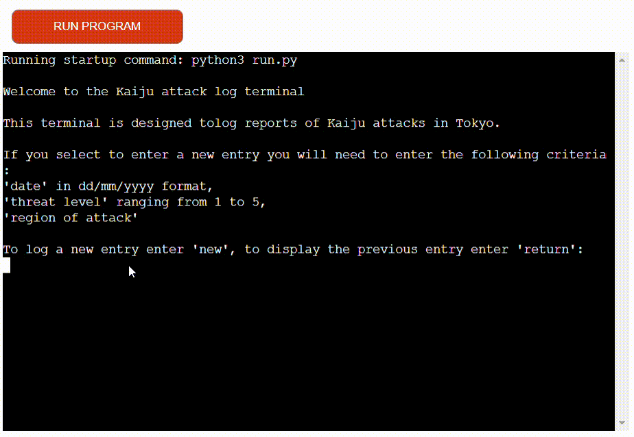

# Kaiju Attack Log

The Kaiju Attack Log was inspired by a popular manga/ anime named Kaiju No.8, where large monsters (aka Kaiju) attack Japan. 
The Kaiju Attack Log is an interactive terminal to enter details of Kaiju attacks as if the user was in the manga/ anime.

[Click here to view](https://kaiju-attack-terminal-cf4d13c89f69.herokuapp.com/) 

## Contents

* [Program Flow Chart](#program-flow-chart)

* [Features](#features)
    * [Program start](#program-start)
    * [New entry to Kaiju attack log](#new-entry-to-kaiju-attack-log)
    * [Additional entry](#additional-entry)
    * [Return last entry](#return-last-entry)
* [Future Enhancements](#future-enhancements)
* [Testing](#testing)
* [Libraries](#libraries)
* [Technologies Used](#technologies-used)
* [Deployment](#deployment)

## Program Flow Chart

To understand the structure of the program, I created a flow chart using [Lucid Charts](https://lucid.app)

# Features

## Program start

When the program starts the user will be greeted with a welcome message and instructions on how to use the terminal.
The user will have two input options to select from when the program starts 'new' or 'return'

## New entry to Kaiju attack log

If the user inputs 'new' they will be presented with 3 sets of criteria to fill in which will update a google worksheet via API.

* The first criteria required is a date of Kaiju attack, the date must be in a dd/mm/yyyy format
* The second criteria required is a threat level of the Kaiju attack which is scored between 1 and 5 
* The final criteria required is a region which can be selected by entering the corresponding number to the region.

## Additional entry

Once the user has entered all the relevant information they will receive a confirmation message to advise the Kaiju attack log was updated successfully. 
From there two further options will be presented asking if the user would like to input another entry 'y' or return to menu 'n'.
If the user inputs 'y' they will be presented with the date, threat and region inputs.
If the user inputs 'n' they will return to the main menu.

## Return last entry

The user has the option on the main menu to return the last entry by inputting 'return'. This will display on the terminal the date, threat and region of the last entry.

# Future Enhancements

* A future enhancement to the program is to restrict the date entry to no dates greater than today.
* An additional enhancement to the program is to add Try & Except statements when working with the Google worksheet in case there is an error from Google.
* Adding while loops into areas of the code such as additional_entry or start_program to make a more friendly user experience so not all print statements are displayed once the user has run through the program.

# Testing
**Feature**|**Expectation**|**Test**|**Output expectation**|**Result**
-----|-----|-----|-----|-----
start\_program|When I enter python3 run.py the start\_program should load print statements welcoming and explaining the program to the user|run pyhton3 run.py in terminal|Welcome messages, about program and input for new or return entry displaying in terminal|pass
start\_program|When I enter an invalid entry an error message is displayed|Input a 'space' and pressed enter to submit|Invalid input message to be displayed|pass
start\_program|When I enter an invalid entry an error message is displayed|Input 'test' and pressed enter to submit|Invalid input message to be displayed|pass
start\_program|When I enter an invalid entry an error message is displayed|Input a number and pressed enter to submit|Invalid input message to be displayed|pass
start\_program|When I enter an invalid entry an error message is displayed|Input a special character and pressed enter to submit|Invalid input message to be displayed|pass
start\_program|When I enter a valid input 'new'|Input 'new' and pressed enter |attack\_log function to be called and display in terminal|pass
start\_program|When I enter a valid input 'return'|Input 'return' and pressed enter |return\_last\_entry fuction to be called and display in terminal|pass
return\_last\_entry|Previous entry on worksheet to be display on terminal|Return' input entered on start\_program the return\_last\_entry function called|Last row from worksheet to be displayed in terminal |pass
get\_date\_data|Run program in terminal|New' input entered on start\_program the attack\_log function called|get\_date\_data function to be called and display on terminal|pass
get\_date\_data|When I enter an invalid entry an error message is displayed|Input a date in an invalid for '1/1/24'|Invalid input message to be displayed|pass
get\_date\_data|When I enter an invalid entry an error message is displayed|Input a special character '01/01!2024'|Invalid input message to be displayed|pass
get\_date\_data|When I enter an invalid entry an error message is displayed|Input a date without '/' inbetween date|Invalid input message to be displayed|pass
get\_date\_data|When I enter an invalid entry an error message is displayed|Input text instead of a date|Invalid input message to be displayed|pass
get\_date\_data|When I enter a valid date format to be taken to get\_threat\_data|Input date in requested format '01/01/2024'|get\_threat\_data function to be called and display on terminal as next step|pass
get\_threat\_data|Run program in terminal|Valid date format entered in get\_date\_data |get\_threat\_data function to be called and display on terminal|pass
get\_threat\_data|When I enter an invalid entry an error message is displayed|Input an invalid entry of '-1'|Invalid input message to be displayed|pass
get\_threat\_data|When I enter an invalid entry an error message is displayed|Input an invalid entry of 'cat'|Invalid input message to be displayed|pass
get\_threat\_data|When I enter an invalid entry an error message is displayed|Input an invalid entry of ' ' (whitespace)|Invalid input message to be displayed|pass
get\_threat\_data|When I enter an invalid entry an error message is displayed|Input an invalid entry of '1!'|Invalid input message to be displayed|pass
get\_threat\_data|When I enter a valid threat level entry to be taken to get\_region\_data|Valid threat level entered in get\_threat\_data '5'|get\_region\_data function to be called and display on terminal as next step|pass
get\_region\_data|Run program in terminal|Valid threat level entered in get\_threat\_data|get\_region\_data function to be called and display on terminal|pass
get\_region\_data|When I enter an invalid entry an error message is displayed|Input an invalid entry of '-1'|Invalid input message to be displayed|pass
get\_region\_data|When I enter an invalid entry an error message is displayed|Input an invalid entry of 'Ginza'|Invalid input message to be displayed, although this is in the dictionary it is not a valid input|pass
get\_region\_data|When I enter an invalid entry an error message is displayed|Input an invalid entry of '!'|Invalid input message to be displayed, although this is in the dictionary it is not a valid input|pass
get\_region\_data|When I enter an invalid entry an error message is displayed|Input an invalid entry of '1!'|Invalid input message to be displayed, although this is in the dictionary it is not a valid input|pass
get\_region\_data|When I enter a valid region number entry additional\_entry function to be called|Input valid region number entered '5'|Confirmation message printed to advise the log was successfully updated and then additional\_entry function to be called|pass
additional\_entry|Run program in terminal|Valid region number entered and worksheet updated |additional\_entry to be displayed in terminal|pass
additional\_entry|When I enter an invalid entry an error message is displayed|Input an invalid entry of '5'|Invalid input message to be displayed|pass
additional\_entry|When I enter an invalid entry an error message is displayed|Input an invalid entry of ':'|Invalid input message to be displayed|pass
additional\_entry|When I enter an invalid entry an error message is displayed|Input an invalid entry of 'yes'|Invalid input message to be displayed|pass
additional\_entry|When I enter a valid input of 'y' the attack\_log function to be called|Input valid entry of 'y'|attack\_log function called displaying get\_date\_data function|pass
additional\_entry|When I enter a valid input of 'n' the start\_program function to be called|Input valid entry of 'n'|start\_program function called and displaying in terminal|pass

# Libraries

### The following libraries were installed to aid the program

**Libraries**|**Function of library**
:-----:|:-----:
colorama|colorama was installed to display coloured text in the terminal to allow for a better experiece.
Gspread|Gspread library was installed to allow API integration to Google Sheets.
Google auth|Google auth was installed to authorize access the Google API securely.
datetime|datetime library was installed to allow manipulation and validation when working with date inputs.

# Technologies Used

* **Lucid Charts** was used to create and design a flowchart for the project
* **VSCode** was the code editor used for the project
* **Python** was the language used through out the project
* **Heroku** was used to deploy the application
* **Git** was used to commit code
* **GitHub** was used to store the repo
* **CI Python Linter** was used to display any formatting errors

# Deployment

Before deploying to Heroku I added the list of dependencies for the project to requirements.txt by using the following command 'pip3 freeze > requirements.txt'

Once the dependencies were successfully on the requirements.txt file I committed the changes and pushed the code to GitHub.

Now I needed to deploy the application on Heroku using the below steps.

1. Log in to Heroku or create account
2. Click the **new** button on the top right to display drop down
3. Select **create new app**
4. Enter app name - *this must be a unique name*
5. Choose relevant region
6. Click **create app**
7. On the application dashboard select **settings**
8. Scroll down to *Config Vars*
9. Click on **Reveal_Config vars**
10. Enter 'CREDS' in key
11. From VS Code copy *creds.json* code into value and click **add**
12. Enter 'PORT' in key
13. Enter '8000 in value and click **add**
14. Scroll down to *Buildpacks*
15. Click **Add buildpack**
16. Select *python* and click **Add buildpack**
17. Click 'Add buildpack'
18. Select *nodejs* and click **Add buildpack**
    * nodejs must appear under python in buildpacks.
19. Select **deploy** at the top of the application dashboard
20. Select **GitHub** as deployment method
21. Search for repository name and click **connect**
21. Scroll down and select either **Enable Automatic Deploys** or **Deploy Branch** for manual deployment.
22. This will then run the process to deploy the application
23. Click on **View** once successfully deployed

