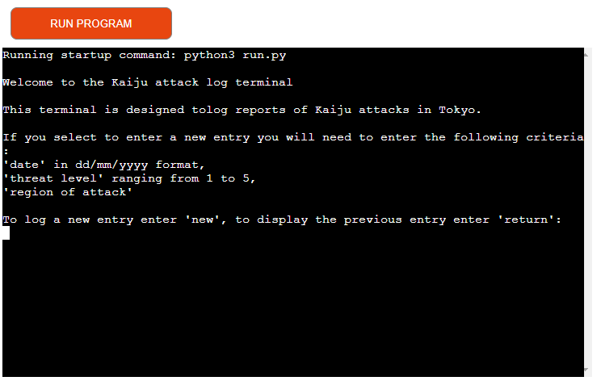

# Kaiju Attack Log

The Kaiju Attack Log was inspired by a popular manga/ anime named Kaiju No.8, where large monsters (aka Kaiju) attack Japan. 
The Kaiju Attack Log is an interactive terminal to enter details of Kaiju attacks as if the user was in the manga/ anime.

[Click here to view](https://kaiju-attack-terminal-cf4d13c89f69.herokuapp.com/) 

## Contents

* [Program Flow Chart](#program-flow-chart)

* [Features](#features)
    * [Program start](#program-start)
    * [New entry to Kaiju attack log](#new-entry-to-kaiju-attack-log)
    * [Additional entry](#additional-entry)
    * [Return last entry](#return-last-entry)

* [Future Enhancements](#future-enhancements)
* [Testing](#testing)
* [Bugs and debugging]()
* [Libraries](#libraries)
* [Technologies Used](#technologies-used)
* [Deployment](#deployment)

## Program Flow Chart

To understand the structure of the program, I created a flow chart using [Lucid Charts](https://lucid.app)

# Features

## Program start

## New entry to Kaiju attack log

## Additional entry

## Return last entry

# Future Enhancements

# Testing
**Function**|**Test**|**Test Version**|**Expectation**|**Result**
:-----:|:-----:|:-----:|:-----:|:-----:
start\_program|Run program in terminal|V1|When I enter python3 run.py I am expecting the start\_program to begin, displaying all relevant print strings and input string|Pass
start\_program|Enter invalid input|V1|When I enter an invalid input option I am expecting to see an error message due to validation|Pass
start\_program|Enter return input|V1|When I enter 'return' I am expecting the previous entry on the Kaiju attack log to be returned to the terminal and then the additional\_entry function to run in the terminal|Pass
start\_program|Enter new input|V1|When I enter 'new' I am expecting the next function to run in the terminal|Pass
return\_last\_entry|Receiving the last entry in the terminal|V1|I am expecting the last entry on the worksheet to be displayed in the terminal and the additional\_entry function to run|Pass
get\_date\_data|Run program in terminal|V1|After entering 'new' from the start\_program function I am expecting the get\_date\_data function to run|Pass
get\_date\_data|Enter invalid input|V1|When I enter an invalid input format I am expecting to see an error message due to validation|Pass
get\_date\_data|Enter valid input|V1|When I enter a valid input I am expecting to see a confirmation message and the get\_threat\_data function to run in the terminal|Pass
get\_threat\_data|Enter invalid input|V1|When I enter an invalid input format I am expecting to see an error message due to validation|Pass
get\_threat\_data|Enter valid input|V1|When I enter a valid input I am expecting to see a confirmation message the get\_region\_data function to run in the terminal|Pass
get\_region\_data|Enter invalid input|V1|When I enter an invalid input format I am expecting to see an error message due to validation|Pass
get\_region\_data|Enter valid input|V1|When I enter a valid input I am expecting to see a confirmation message |Pass
update\_attack\_log|Run program in terminal|V1|After running get\_date\_data, get\_threat\_data and get\_region\_data I am expecting to see a message advising the user the information entered is updating the worksheet, a confirmation message of successful update to the worksheet and, additional\_entry function run in the terminal|Pass
update\_attack\_log|Worksheet update|V1|Load worksheet to ensure the entry submitted has infact updated the worksheet|Pass
additional\_entry|Enter invalid input Y|V1|When I enter a valid input of 'Y' I am expecting attack\_log function to run in terminal to allow user to enter another entry|Pass
additional\_entry|Enter invalid input N|V1|When I enter a valid input of 'N' I am expecting start\_program function to run to reset the terminal to the beginning of the program|Pass
additional\_entry|Enter valid input|V1|When I enter an invalid input I am expecting to see an error message due to validation|Pass

# Libraries

# Technologies Used

# Deployment